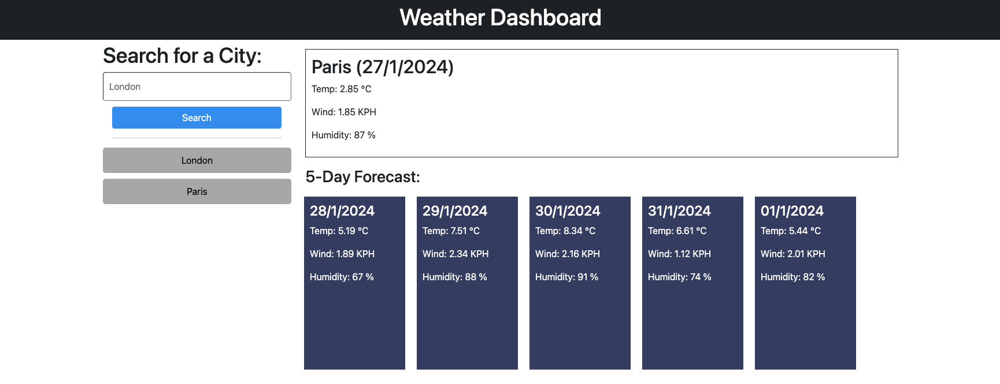

# weather-dashboard

## Description

This is weather dashboard that retrieves data on the current weather details for a given city, in addition to providing a 5-day forecast. It acheives this by utilising two OpenWeather APIs: the 5 Day/3 Hour Forecast, and the Geocoding API. This was a challenging project but helped further my knowledge on how APIs can be used, and gave me more practice with making use of local storage.

## Installation

No installation necessary. Please visit https://alex-quayle.github.io/weather-dashboard/ to view the webpage. Below is a screenshot of the deployed page:

## Credits

The HTML  for this project was provided by edX. In addition to the following links, the class sessions held by the edX front-end bootcamp team have been invaluable for this challenge, especially in my understanding of API requests and jQuery.

> OpenJS Foundation (n.d.). :contains()Selector. https://api.jquery.com/contains-selector/.

> W3Schools (n.d.). JSON.parse(). https://www.w3schools.com/js/js_json_parse.asp.

> W3Schools (n.d.). JSON.stringify(). https://www.w3schools.com/js/js_json_stringify.asp.